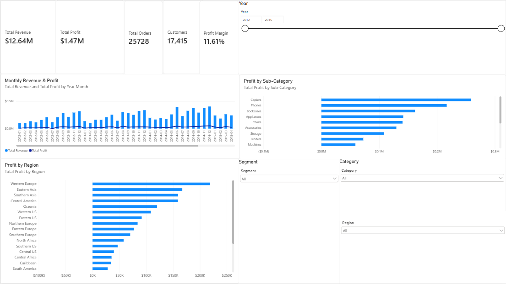
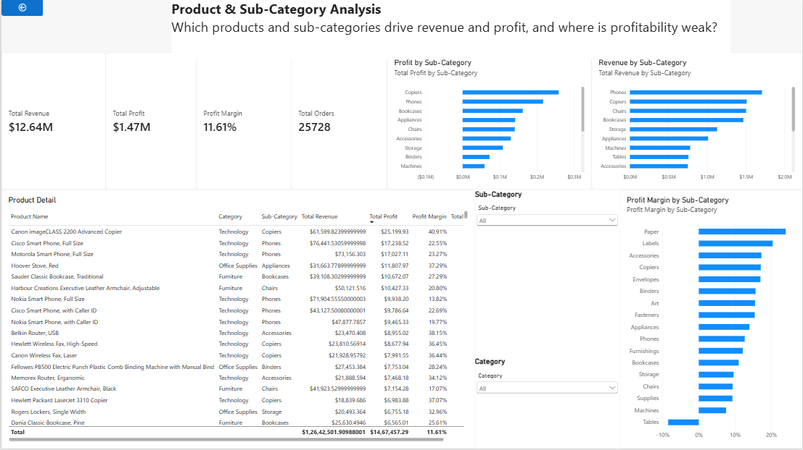
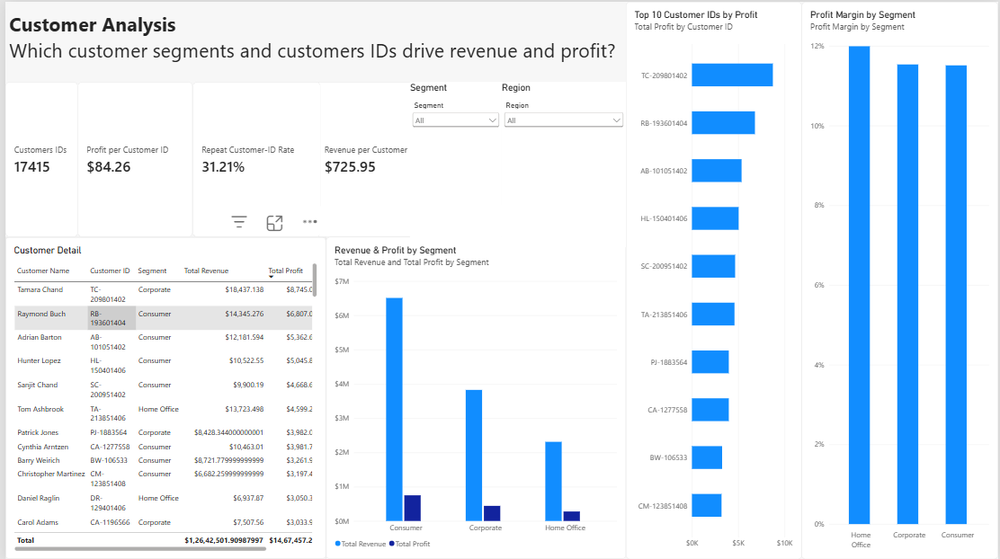
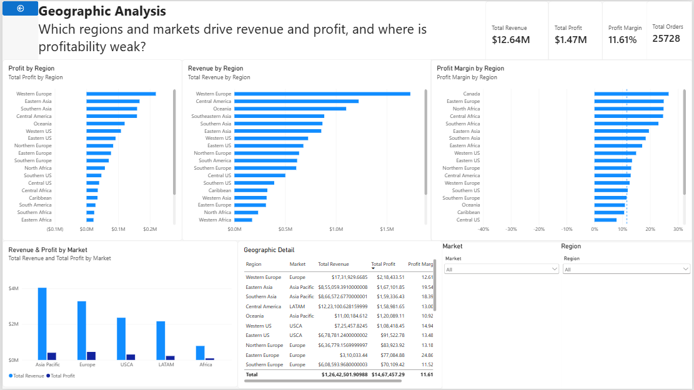
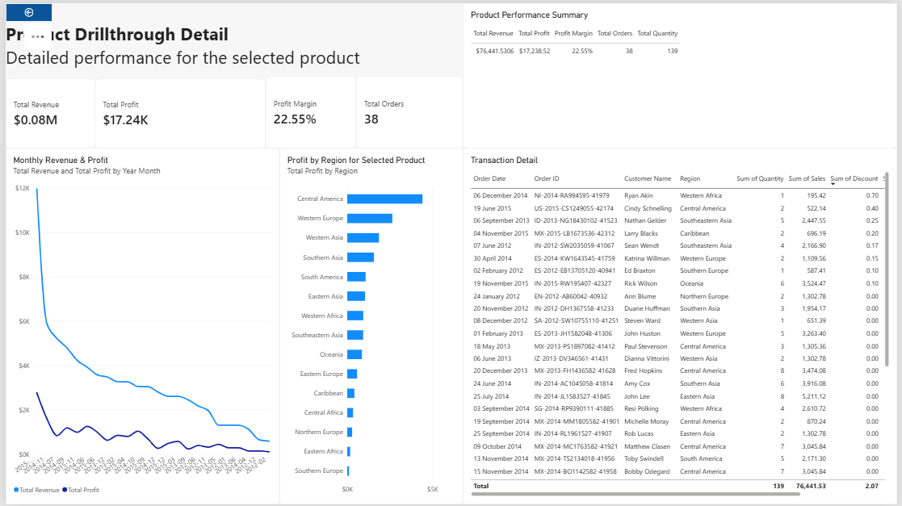

# E-Commerce Sales Analytics

An end-to-end sales analytics project using **Microsoft Excel, PostgreSQL, and Power BI** to investigate revenue, profitability, discounting, product performance, regional results, and customer behavior.

## Project Overview

Retail transaction data can show more than sales totals. It can reveal which products contribute to profit, where the business is losing money, how performance changes over time, and whether revenue growth corresponds to stronger profitability.

This project analyzes the Global Superstore 2016 dataset to answer those questions through data cleaning, KPI analysis, SQL queries, interactive dashboards, and business findings.

The project uses the same source dataset across Excel, PostgreSQL, and Power BI to keep the analysis consistent and allow results to be cross-checked.

## Business Questions

- How much revenue and profit did the business generate?
- How did revenue and profit change month by month?
- Which product categories and sub-categories contribute most to profit?
- Which sub-categories have weak or negative profitability?
- How are discount levels associated with profit margins?
- Which regions and markets generate the most revenue and profit?
- How do customer segments differ in scale and profitability?
- Which Customer IDs generate the most profit?
- What proportion of Customer IDs have placed more than one distinct order?
- How does performance vary by shipping mode?

## Dataset

**Source:** [Global Superstore 2016 dataset](https://github.com/andrewmanueld/dataset_global_superstore_2016)

| Attribute | Details |
|---|---|
| Records | 51,290 transaction-line records |
| Original columns | 24 |
| Date range | January 2012 – December 2015 |
| Data grain | One row per transaction line |
| Database | PostgreSQL |
| Analytics tools | Excel and Power BI |

The dataset contains order, customer, product, date, geography, shipping, sales, quantity, discount, and profit fields.

**Important:** A transaction line is not necessarily a unique order. An order can contain multiple line items, so order counts use distinct `Order ID` values rather than counting rows.

**Currency note:** The source dataset does not contain an explicit currency-code field. Monetary measures in the Power BI report are displayed with a `$` symbol as a presentation convention; the currency has not been independently verified from a source field. No currency conversion was performed. Treat monetary values as source amounts rather than confirmed USD amounts.

## Power BI Dashboard Preview

### 1. Executive Overview

### 2. Product Analysis

### 3. Customer Analysis

### 4. Geographic Analysis

### 5. Drillthrough Detail

## Tools Used

- **Microsoft Excel:** data inspection, Power Query cleaning, PivotTables, KPI calculations, monthly growth analysis, and dashboarding.
- **PostgreSQL:** data validation, aggregations, business analysis, CTEs, joins, window functions, ranking, and customer analysis.
- **Power BI:** data modeling, DAX measures, interactive reports, slicers, and product drillthrough.
- **Git and GitHub:** version control, SQL scripts, workbook storage, screenshots, and project documentation.
- **AI assistants:** used to accelerate drafting and debugging and to challenge analytical conclusions. Results were checked against the dataset and other tool outputs.

## Methodology

### 1. Data Inspection and Cleaning

The original dataset was preserved separately from the cleaned data.

Power Query was used to create a derived clean query. The cleaning process included assigning appropriate data types and trimming leading or trailing spaces from `Product Name`.

The cleaning approach was deliberately conservative:

- Preserved all 51,290 records.
- Preserved all 24 original columns.
- Retained missing postal codes rather than deleting otherwise valid transactions.
- Retained negative-profit transactions, high discounts, and extreme values for analysis.
- Did not remove repeated Order IDs, because multiple line items can belong to the same order.

### 2. Excel Analysis

Excel was used to validate KPIs and explore the data through PivotTables and supporting calculations.

The analysis covers:

- Overall KPI summary
- Monthly revenue, profit, orders, profit margin, and month-over-month growth
- Category and sub-category profitability
- Discount-band analysis
- Regional performance
- Customer-segment performance
- Executive dashboard with slicers

### 3. SQL Analysis

The cleaned data was imported into PostgreSQL as `global_superstore_orders`.

The SQL scripts answer business questions through aggregations, distinct counts, CTEs, joins, conditional logic, and window functions.

The analysis includes:

- KPI validation
- Monthly revenue and profit trends
- Month-over-month growth
- Category and sub-category analysis
- Discount-band profitability
- Regional and customer-segment analysis
- Top customers and products
- Loss-making products
- Repeat Customer-ID analysis
- Rankings within categories
- Cumulative revenue and profit
- Revenue contribution by category
- Shipping-mode performance

### 4. Power BI Reporting

The report contains five pages:

| Page | Purpose |
|---|---|
| Executive Overview | Overall KPIs and business performance trends |
| Product & Sub-Category Analysis | Revenue, profit, and margin by product group |
| Customer Analysis | Customer-ID metrics, segment comparisons, and leading Customer IDs |
| Geographic Analysis | Revenue, profit, and margin across regions and markets |
| Product Drillthrough Detail | Product-specific monthly trends, regional performance, and transaction details |

The report uses a date table related to the transaction fact table, DAX measures, slicers, and product-level drillthrough.

## KPI Definitions

| KPI | Definition |
|---|---|
| Total Revenue | Sum of `Sales` |
| Total Profit | Sum of `Profit` |
| Total Orders | Distinct count of `Order ID` |
| Customer IDs | Distinct count of `Customer ID` |
| Total Quantity | Sum of `Quantity` |
| Average Order Value | Total Revenue ÷ Total Orders |
| Profit Margin | Total Profit ÷ Total Revenue |
| Repeat Customer-ID Rate | Customer IDs with more than one distinct order ÷ total Customer IDs |

Profit margin is calculated from aggregated profit and revenue, rather than averaging individual transaction-line margins.

## Key Findings

### Overall Performance

| Metric | Result |
|---|---:|
| Revenue | 12,642,501.91 |
| Profit | 1,467,457.29 |
| Distinct Orders | 25,728 |
| Distinct Customer IDs | 17,415 |
| Quantity Sold | 178,312 |
| Average Order Value | 491.39 |
| Overall Profit Margin | 11.61% |

The KPI calculations were cross-checked between Excel and PostgreSQL.

### Product Profitability

- **Copiers** generated the largest sub-category profit, approximately 258,567.55, with a 17.13% margin.
- **Tables** was the only loss-making sub-category in the category analysis, with approximately -64,083.39 profit and a -8.46% margin.
- **Machines** had a 7.56% margin, below the overall 11.61% benchmark.
- **Paper** had the highest sub-category margin at 24.03%.

These results distinguish absolute profit contribution from profit margin: a product group can generate substantial profit while still having a below-average margin.

### Discount and Profitability

Profitability declined across the defined discount bands:

| Discount Band | Profit Margin |
|---|---:|
| 0–10% | 23.55% |
| >10–20% | 9.86% |
| >20–30% | -5.53% |
| >30–40% | -23.69% |
| >40–50% | -45.26% |
| >50–60% | -87.13% |
| >60–70% | -130.50% |
| >70–80% | -188.71% |
| >80% | -385.10% |

**Interpretation:** Higher discount bands are strongly associated with lower profitability in this dataset. This aggregated analysis does not prove that discounting alone caused the losses; product mix, pricing, costs, and other factors may contribute.

Distinct order counts by discount band can overlap because one order may contain line items with different discounts. The counts should not be added to derive total dataset orders.

### Regional Performance

- **Western Europe** generated the highest regional revenue and profit.
- **Western Asia** had the largest absolute regional loss.
- **Central Asia** had the lowest regional profit margin.
- Several substantial-revenue regions, including Southeastern Asia and South America, had margins well below the overall benchmark.
- Five leading profit-contributing regions accounted for approximately 56% of total profit.

Regional totals identify where performance differs, but they do not establish why the differences occur.

### Customer Analysis

- The **Consumer** segment generated the most revenue and profit in absolute terms.
- Revenue and profit per Customer ID were similar across the three segments.
- The **Home Office** segment had the highest margin at 11.99%, compared with the overall 11.61%.
- The repeat-customer calculation identified 5,436 Customer IDs with more than one distinct order, representing 31.21% of the 17,415 Customer IDs.

**Customer identifier limitation:** Customer metrics use `Customer ID` as the analytical key. The source also contains repeated customer names across different IDs. Therefore, distinct Customer-ID counts should not be interpreted as a verified count of unique real-world individuals.

## Validation

The project checked key results across Excel and PostgreSQL:

- Raw and cleaned datasets retained 51,290 transaction-line records.
- The cleaned dataset retained 24 columns.
- Revenue, profit, quantity, distinct orders, and distinct Customer IDs reconciled across the main KPI calculations.
- Discount-band totals were reconciled before drawing final conclusions.
- Monthly SQL analysis returned 48 months, from January 2012 through December 2015.

## Repository Structure

- `data/` — source and processed data files
- `excel/` — Excel workbook and analysis
- `sql/` — PostgreSQL schema, validation, and analytical queries
- `powerbi/` — Power BI report
- `screenshots/` — dashboard and analysis screenshots
- `README.md` — project documentation

## How to Explore the Project

1. Open the Excel workbook in Microsoft Excel to inspect the Power Query outputs, PivotTables, calculations, and dashboard.
2. Open the `.sql` files in PostgreSQL/pgAdmin and run them against the `global_superstore_orders` table.
3. Open the `.pbix` report in Power BI Desktop to explore the five report pages, filters, and product drillthrough.
4. Review the `screenshots/` folder for previews of selected outputs and findings.

## Limitations

- The source dataset contains no explicit currency-code field, and this analysis does not perform currency conversion.
- The analysis is descriptive. Observed associations do not, by themselves, establish causation.
- Customer-level metrics are calculated at Customer-ID grain and may not represent unique individuals.
- Regional, product, and discount-band aggregates can conceal variation among individual transactions.

## Conclusion

This project demonstrates an end-to-end analytics workflow: preserving source data, cleaning and validating it, defining consistent KPIs, analyzing business performance in Excel and PostgreSQL, and presenting findings through an interactive Power BI report.

The central analytical lesson is that **revenue, profit, and profit margin answer different questions**. Evaluating them together helps identify product groups, discount bands, and regions that warrant further investigation.
